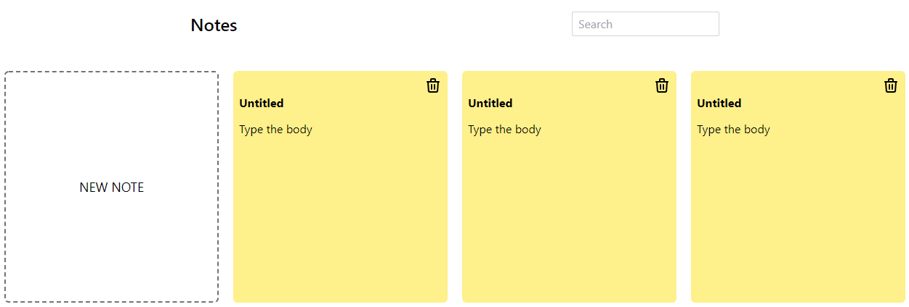

# Svelte Notes App

Notes application to practice Svelte

<h2>
  <a href="https://armcruz.github.io/svelte-notes-app/">Live Demo</a>
</h2>

## Features

- Add an untitled new note
- Edit the title and body of the note
- Remove a note

### Enhacements

- Save notes in the local storage and read them on the initial load
- Turn it to a full stack app with SvelteKit
  - Add authentication
  - Add authorization
  - Add user preferences (theme, notes colors, etc)
